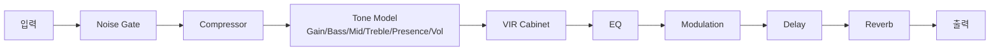

# IK Multimedia TONEX Pedal

> [!info] 한 줄 요약
> AI 머신 모델링 기반 앰프/캡 모델러 + 멀티FX + USB 오디오 인터페이스. 본 보드 톤의 심장.

## 개요

- 실제 앰프·캐비닛·페달을 AI로 캡처(Tone Model)하여 재현하는 모델러
- 앰프 시뮬 + Noise Gate + Compressor + VIR 캐비닛 + EQ + Modulation + Delay + Reverb를 프리셋 단위로 통합
- USB-C 오디오 인터페이스 내장 → 라이브(LIVE) / 인터페이스(INTERFACE) 모드 전환
- 시그널 체인 중앙 배치 → 물리 드라이브 페달의 신호를 받아 앰프단 담당 ([[signal-chain]])
- 세부 설정 모드는 [[tonex-setting]], 프리셋별 앰프 시뮬은 [[tonex-amp-simuls]] 하위 문서 참고

## 제원

| 항목 | 값 |
| --- | --- |
| 카테고리 | 앰프/캡 모델러 + 멀티FX |
| 전원 | 9V DC / 320mA / 센터 네거티브 |
| 배터리 | 미지원 |
| 오디오 성능 | 24-bit / 192kHz, 응답 5Hz–24kHz, DR 최대 123dB |
| 프리셋 | 최대 150개 (50뱅크 × 3슬롯) |
| 크기 | 176 × 142 × 55 mm |
| 무게 | 906 g |
| 섀시 | 아노다이즈드 알루미늄 |

## 입출력 단자

| 단자 | 타입 | 용도 |
| --- | --- | --- |
| INPUT | 1/4" | 악기/앞단 페달 입력 |
| OUTPUT L / R | 1/4" | 스테레오 출력 (L = 모노 겸용) |
| HEADPHONES | 1/4" | 헤드폰 (L/R 동일 신호) |
| MIDI IN / OUT | 1/8" TRS Type A | MIDI 제어 (DIN 어댑터 동봉) *단자 형태 확인 필요* |
| EXTERNAL CONTROL | 1/4" | 익스프레션/스위치 페달 (파라미터 할당) |
| USB | USB-B | 오디오 인터페이스 + 프리셋 관리 |
| POWER IN DC | 2.1mm 센터 네거티브 | 전원 |

## 컨트롤

### 로터리 인코더 (3개, push / turn / hold)

| 인코더 | 돌리기(turn) | 누르기(push) | 길게(hold) |
| --- | --- | --- | --- |
| MODEL | Tone Model 변경 | — | BPM · PRESET · GLOBAL SETUP 진입 |
| PRESET | 프리셋 브라우징(150개) | 메뉴 뒤로가기 | 현재 프리셋 저장 |
| PARAMETER | 값 편집 | 어드밴스드 파라미터 메뉴 | ALT 파라미터 활성화 |

### 메인 노브 (5개, 듀얼 펑션)

> 기본 파라미터 ↔ ALT 파라미터(PARAMETER 인코더 hold 시 전환)

| 노브 | 기본 | ALT |
| --- | --- | --- |
| 1 | GAIN | REVERB |
| 2 | BASS | COMPRESSOR |
| 3 | MID | NOISE GATE |
| 4 | TREBLE | PRESENCE |
| 5 | VOLUME | DEPTH |

### 풋스위치 (3개: A / B / C)

| 조작 | 동작 |
| --- | --- |
| A / B / C 개별 | 현재 뱅크의 프리셋 선택 · 바이패스 |
| A + B 동시 | 뱅크 다운 |
| B + C 동시 | 뱅크 업 |
| A + C 동시 | 현재 뱅크 표시 |
| 선택된 프리셋 풋스위치 hold | Tune & Tap 모드 (튜너 + 탭템포, C로 BPM 탭) |

### 디스플레이

- 8자리 16-세그먼트 캐릭터 디스플레이 (무대 가시성)
- 컬러 서브 디스플레이: Tone Model · 캐비닛 타입 표시

## 프리셋 구성 모듈

- 프리셋 1개 = 아래 모듈 직렬 체인 (어드밴스드 파라미터 메뉴에서 편집)

| 모듈 | 내용 |
| --- | --- |
| NOISE GATE | 노이즈 게이트 (Threshold 등) |
| COMPRESSOR | 컴프레서 |
| TONE MODEL | 앰프/캡 캡처 (GAIN·BASS·MID·TREBLE·PRESENCE·VOLUME) |
| VIR CABINET | 멀티-IR 가상 캐비닛 + 커스텀 IR 로더, CAB 바이패스 가능 |
| EQ | Bass / Mid / Treble / Presence |
| MODULATION | chorus / tremolo / phaser / flanger / rotary |
| DELAY | digital / tape |
| REVERB | SPRING 1~4 / ROOM / PLATE (스테레오) |

## 주요 톤 셋업 (5종 이상)

| # | 셋업 | 핵심 설정 | 용도 |
| --- | --- | --- | --- |
| 1 | 클린 백킹 | 클린 Tone Model + Gate OFF + Plate Reverb | 청량한 커팅 |
| 2 | 크런치 리듬 | 크런치 Tone Model + Comp PRE + 약한 Reverb | 록 백킹 |
| 3 | 하이게인 리프 | 하이게인 Tone Model + Gate FIRST + Comp | 메탈/뉴메탈 |
| 4 | 솔로 리드 | 리드 Tone Model + Delay + Presence↑ | 솔로 부각 |
| 5 | 스톰박스 부스트 | STOMP 모드로 단일 프리셋 on/off | 물리 페달처럼 활용 |
| 6 | 앰비언트 | 클린 + Shimmer/긴 Reverb + tape Delay | 공간계 레이어 |

## 사용 경험 / 특이사항

- 1,250+ 내장 Tone Model + ToneNET 무료 다운로드
- Tone Model 캡처 생성 자체는 데스크톱 [[tonex-editor]] / TONEX 소프트웨어에서 수행 (페달 단독 캡처 불가)
- 동봉 소프트웨어: TONEX MAX, TONEX Editor, AmpliTube 5

## 관련 문서

- [[tonex-setting]] — 모드/설정 상세
- [[tonex-amp-simuls]] — 프리셋별 앰프 시뮬
- [[tonex-editor]] — 편집 소프트웨어
- [[signal-chain]]
