# 시그널 체인 (Signal Chain)

> [!abstract] 요약
> 기타 → 튜너/버퍼 → 드라이브 → 부스터 → (프리앰프 딜레이) → TONEX → 모듈레이션 → 딜레이 → 리버브 → 인터페이스 순서의 4-Cable 없는 직렬 체인.

## 전체 체인

```mermaid
flowchart LR
  G["🎸 기타<br/>Fender MX Strato"] --> PT["Polytune 3<br/>튜너/버퍼"]
  PT --> OCD["Fulltone OCD<br/>오버드라이브"]
  OCD --> RIOT["Suhr Riot<br/>디스토션"]
  RIOT --> BOOST["Mooer Pure Boost<br/>부스터"]
  BOOST --> MAUDE["Meet Maude<br/>아날로그 딜레이(Pre)"]
  MAUDE --> TONEX["🔊 TONEX<br/>앰프/캡 모델러"]
  TONEX --> TERRA["Wampler Terraform<br/>모듈레이션"]
  TERRA --> DD7["Boss DD-7<br/>디지털 딜레이"]
  DD7 --> IMM["Neunaber Immerse<br/>리버브"]
  IMM --> IF["🎛️ Audient iD4<br/>오디오 인터페이스 / 앰프 Return"]
```

- 기본 순서: **기타 → TC Electronic Polytune 3 → Fulltone OCD → Suhr Riot → Mooer Pure Boost → Fairfield Circuitry Meet Maude → TONEX Pedal → Wampler Terraform → Boss DD-7 → Neunaber Immerse → 오디오 인터페이스 / 앰프 Return**

## 배치 원리 (구간별)

### 1. 프론트엔드 — 튜너/버퍼

- [[tc-electronic-polytune-3]] 최전방 배치 → 임피던스 변환(버퍼)으로 이후 긴 케이블·다수 페달에 의한 고역 손실(하이컷) 방지
- 버퍼는 하이 임피던스(약 1MΩ) 입력을 로우 임피던스 출력으로 변환 → 케이블 정전용량에 의한 톤 손실 억제

### 2. 게인 스테이지 — 드라이브 → 부스터

- [[fulltone-ocd]] → [[suhr-riot]] 순서 직렬 → 앞단 드라이브가 뒷단 드라이브의 입력을 밀어 게인 중첩
- [[mooer-pure-booster]]를 드라이브 **뒷단(Post-Drive)**에 배치 → 클리핑된 신호의 음량만 순수 증폭(솔로 부스트). 상세는 [[booster-pedal-position]] 참고

### 3. 프리앰프 딜레이 — TONEX 앞단

- [[fairfield-circuitry-meet-maude]]를 TONEX **앞단(Pre-Amp)** 배치 → 아날로그/테이프 질감의 반복음이 이후 앰프 시뮬을 통과하며 함께 왜곡 → 지저분하고 유기적인 잔향

### 4. 모델러 — TONEX

- [[tonex|IK Multimedia TONEX]]가 앰프+캐비닛+게이트+컴프+리버브를 담당하는 체인의 심장
- 앰프 시뮬 이후 단(Post)에 공간계 배치 → 왜곡된 신호에 깨끗한 공간감 부여

### 5. 백엔드 — 모듈레이션/공간계

- [[wampler-terraform]] (모듈레이션) → [[boss-dd-7]] (딜레이) → [[neunaber-immerse]] (리버브) 순
- 모듈레이션 → 딜레이 → 리버브 순서 → 반복음/잔향에 모듈레이션이 중첩되지 않고 원음에만 적용되어 명료도 유지

## Pre / Post 배치가 바뀌는 경우

| 페달 | 기본 위치 | 대체 배치 | 효과 변화 |
| --- | --- | --- | --- |
| [[mooer-pure-booster]] | Post-Drive | Pre-Drive | 볼륨 부스트 → 게인/서스틴 부스트 ([[booster-pedal-position]]) |
| [[fairfield-circuitry-meet-maude]] | Pre-Amp | Post-Amp | 지저분한 아날로그 잔향 → 깨끗한 딜레이 |

## 관련 문서

- [[booster-pedal-position]]
- [[INDEX]]
- [[README]]
