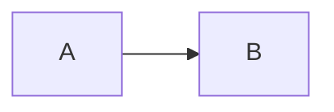

# {{주제}}

> [!abstract] 요약
> {{핵심 원리 한두 줄 명사형}}

## 배경 / 원리

- {{전자·전기·음향적 원리 서술}}

## 상세

- {{}}

## 실전 적용

| 상황 | 적용 |
| --- | --- |
| {{}} | {{}} |

## 관련 문서

- [[signal-chain]]
- {{[[관련 지식/장비]]}}
