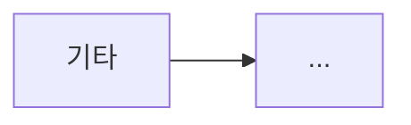

# {{아티스트}} - {{곡명}} ({{세션}})

> [!info] 사운드 컨셉
> {{톤 컨셉 한 줄 명사형}}

## 사용 장비 · 시그널 체인

| 구분 | 장비 |
| --- | --- |
| 기타 | [[fender-mx-stratocastor-2016]] |
| 시그널 체인 | {{체인 순서}} |
| 메인 앰프 시뮬 | {{TONEX 앰프 시뮬명}} |

## 기본 톤

### TONEX 설정

| 구분 | 모듈 / 파라미터 | 설정값 | 비고 |
| --- | --- | --- | --- |
| AMP & CAB | AMP SIM | `{{}}` | {{원본 앰프}} |

### 물리 페달 설정

| 페달명 | ON/OFF | 노브·스위치 설정 |
| --- | --- | --- |
| {{}} | {{}} | {{}} |

## Play (곡 진행별 톤 변경)

### 1. Intro

| 조작 대상 | 변경 내용 |
| --- | --- |
| {{}} | {{}} |

### 2. {{Chorus / Solo …}}

| 조작 대상 | 변경 내용 |
| --- | --- |
| {{}} | {{}} |

## 관련 문서

- [[signal-chain]]
- {{[[사용 페달]]}}
